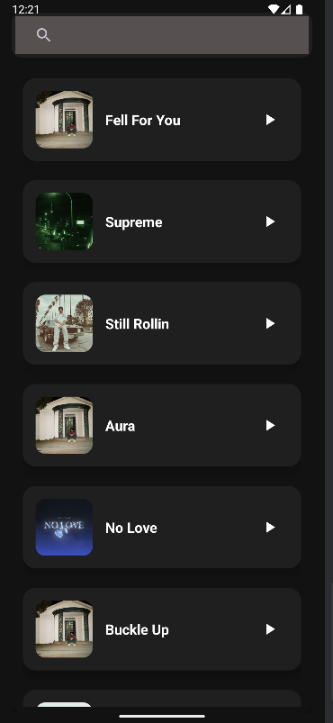
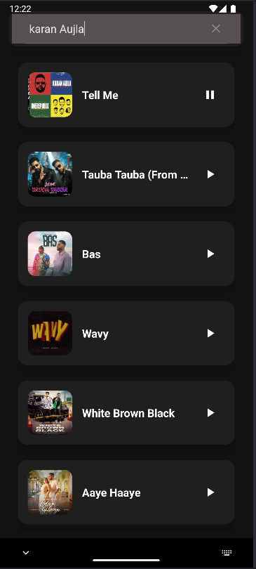

# 🎵 Music Streaming App

A sleek, modern music streaming Android app powered by the Deezer API. The app allows users to search for songs, browse albums and artists, and stream previews directly within the app.


---

## 📸 Preview

| Home Screen | Search Results |
|-------------|----------------|
|  |  |

---

## 🚀 Features

- 🔍 **Search Music** – Search for tracks, artists, and albums using Deezer’s powerful API.
- 🎧 **Stream Previews** – Listen to 30-second song previews.
- 📀 **Album & Artist View** – View track lists by album or artist.
- 📱 **Modern UI** – Clean dark-themed interface with Material Design components.


## 🛠️ Tech Stack

- **Kotlin** – Main programming language.
- **Android SDK** – Core Android development framework.
- **Deezer API** – To fetch music data and stream previews.
- **Material Design** – For a polished UI experience.
- **Glide** – Efficient image loading and caching.

## 📦 Requirements

- Android Studio Bumblebee or later
- Android device or emulator (API level 21+)
- Internet connection (to access Deezer API)

## 🏗️ Setup & Installation

1. **Clone the repository:**
   ```bash
   git clone https://github.com/SHEKHAR011/Music-Streaming-App.git
   cd music-streaming-app
